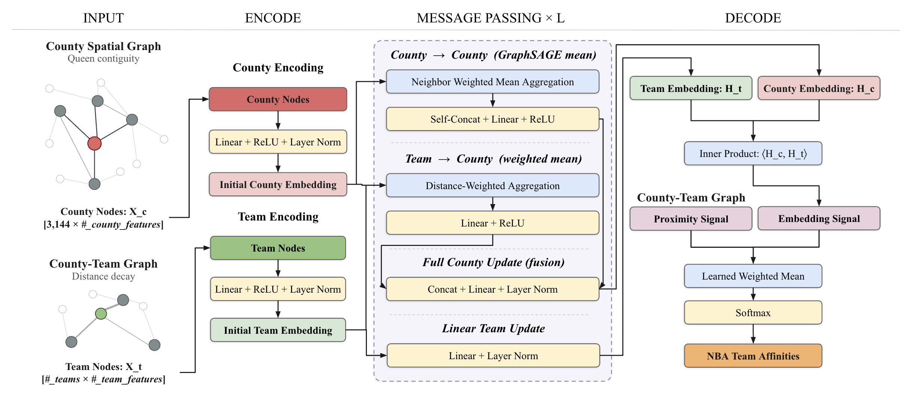
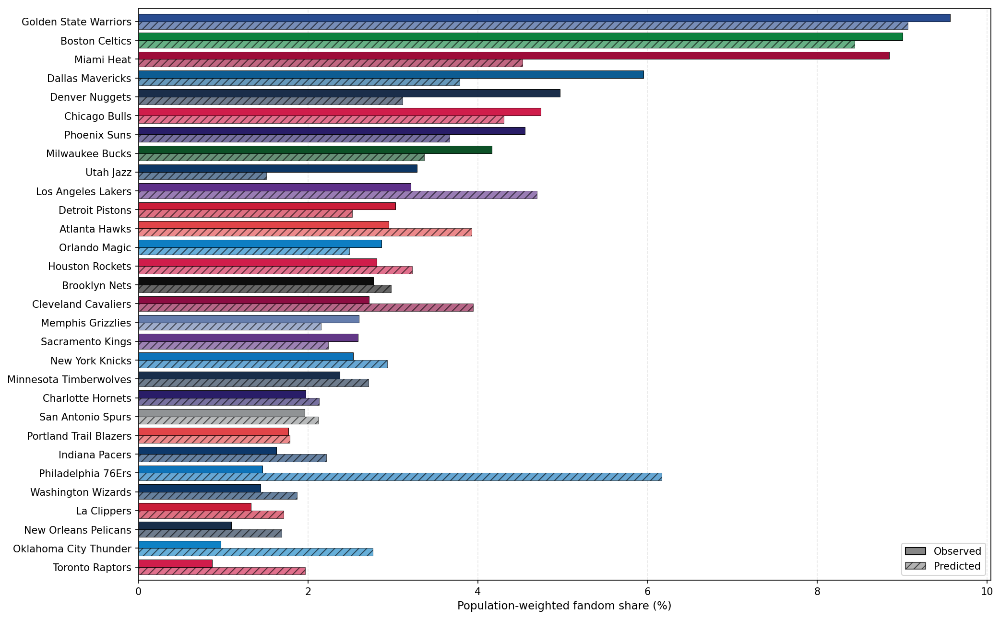
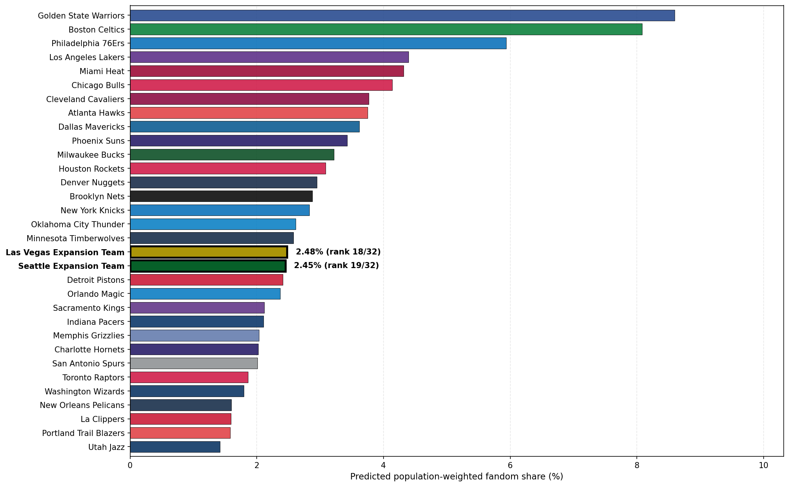

[ View code on GitHub](https://github.com/lukegbenson/nba_fandom_gnn){.btn .btn-outline-primary .btn-sm}

# What happens to NBA fandom when two new teams enter the league?

The National Basketball Association (NBA) is considering expansion. The league has included 30 teams since 2004, but at the start of the decade, league commissioner Adam Silver [hinted](https://www.espn.co.uk/nba/story/_/id/30576045/adam-silver-acknowledges-possibility-nba-expansion){target="_blank"} that more teams could be added at a future date. Earlier this year, Silver [finally announced](https://www.nba.com/news/nba-board-of-governors-exploration-seattle-las-vegas-expansion){target="_blank"} that he would begin a more formal expansion process: the league would officially explore the feasibility of adding two teams in Seattle and Las Vegas.

There are many factors to consider for league expansion, including the impact of distributing talent across more teams, the competitiveness of play, and, crucially, where to place new franchises. Past research has assessed the most optimal cities for expansion through a variety of lenses, including [estimated team travel costs](https://arxiv.org/abs/2512.16968){target="_blank"} and [predicted attendance and revenue](https://doi.org/10.1123/jsm.18.3.274){target="_blank"}. However, central to the consideration of any expansion city is the city’s potential to attract fans: without fans, a new team is doomed to a short lifespan.

The potential for two teams raises an interesting question: given the current geographic distribution of NBA fans across the US, where could new NBA teams in Seattle and Las Vegas expect to attract fans from? How much of the national NBA fanbase could they potentially capture?

# The data

I combined three distinct sets of data for this analysis.

**US counties**: population density, income, age, education, race / ethnicity, and county geometries from the 2024 American Community Survey (ACS).

**NBA teams**: team valuation, recent winning percentage, championships, and stadium locations.

**Team affinities**: estimated support for each NBA team in every US county, derived from 5 years of the latest Google Trends data at the DMA level. 

Importantly, the Google Trends data is limited in a couple key ways.

First, as something derived from only Google searches, it reflects a partial (and very limited) view of true NBA fandom. It's used as a proxy for real fandom here, but other and more complex fandom percentage estimates could be used for a future project.

Second, fandom is not actually observed at the county level here. It's estimated at the Desginated Market Area (DMA) level, where every county belongs to exactly one media market. This constraint influences how I end up training the model.

# How can I model fandom?

## Geography, but not just geography

I want the model to capture two things simultaneously:

**Fans tend to support nearby teams**. A person in Oregon, for example, is more likely to support the Portland Trailblazers than the Boston Celtics.

**But geography is not everything**. The Celtics may still attract fans in Portland because of their historical legacy or recent success. Western Oregon may be more likely to support a team like the Celtics than, say, Northern California because of who lives there.

Conceptually, I frame NBA team affinities in any US county as the product of three principal factors: 1) geographic proximity to teams, 2) team success and legacy, and 3) the demographic and economic makeup of the county and surrounding counties. Learning how these features explain current team affinities then allows me to model how affinities may change upon the introduction of two expansion teams in Seattle and Las Vegas.

## Turning fandom into a graph

I represent this problem as a graph, where there are two distinct types of nodes: counties and NBA teams.

Counties are connected to neighboring counties, allowing a county to influence the ones nearby. Each county is also connected to its nearest NBA teams, with closer teams having stronger connections. The model then learns representations of counties and teams and uses their similarity to estimate how likely each county is to support each team.

More technically, this model is described as an inductive heterogeneous graph neural network (GNN). The GNN learns a general function which inputs the features of US counties and NBA teams and then outputs team affinities. By learning a *function* rather than fixed representations of the specific counties and teams, the model can then generalize to unseen counties or teams; this step is critical for when I add new teams in Seattle and Las Vegas. This is the kind of inductive GNN framework which was introduced in [GraphSAGE](https://arxiv.org/abs/1706.02216){target="_blank"}.

The GNN can broadly be broken down into three components: 1) encoding, 2) message passing, and 3) decoding. The encoding layer consists of simple multilayer perceptrons (MLPs) which build initial embeddings for each team and county based solely on the node features. The message passing layer then updates county embeddings based on its proximal counties and closest *K* NBA teams. These first two components both use 30% dropout to reduce overfitting with a (relatively) small dataset. Finally, the decoding layer calculates the inner product between county embeddings and team embeddings to obtain a similarity score. This score is then weighted alongside a fixed distance decay score. Applying a Softmax function to the weighted scores over each county results in estimated county-level team fandom percentages.

Conceptually, I want to represent counties and teams in some shared latent space. County representations are informed both by geographic neighbors and by proximal NBA teams, while team representations depend only on team features: the resulting inner product between county and team embeddings captures latent similarity. County-team similarity is averaged with fixed county-team proximity — essentially framing fandom as something that is explained partially by pure geography, but also by the interactions between county and team identities.

## Spatially-aware training

The construction of the loss function has a few technical details worth mentioning. I start with KL-Divergence, which is a standard metric for computing how a given distribution (predicted team affinities) diverges from a reference distribution (true team affinities).

Given that team affinities were acquired at the DMA level, I calculate the loss by averaging county predictions at the DMA level: county-level variation within a DMA doesn’t exist in the observed data, but I don’t want to penalize the model for predicting such variation.

I also add a Laplacian regularizer to the loss which penalizes counties for having affinities vastly different from their neighbors. This serves as a smoothing function during training.

## Pretending teams are actually new

There's an important consideration in trying to predict expansion: the teams we observe aren't just a random sample of where NBA teams could exist.

The league already has teams in many of the country's largest and most well-established basketball markets. New York and Los Angeles have two teams each. Chicago has a team, the Bay Area has a team, Boston has a team. Seattle and Las Vegas do not. If I train and validate a model which doesn't account for this, it could learn relationships that work well for existing NBA markets but don't generalize to the kinds of markets where expansion is actually being considered.

I, therefore, need a training process which goes beyond a standard train-validation split and, instead, more closely mirrors the NBA expansion process. Rather than randomly splitting the 30 teams into training and validation sets, I keep the 15 highest-fandom teams in every training set. I hold out three of the remaining teams at a time, creating five folds balanced by total fandom. I then select the model which, on average, performs the best on the unseen teams across the cross-validation folds.

This approach ensures that the model always learns in the presence of the league's highest-fandom teams while being evaluated on its ability to generalize to new teams. This better reflects the real-world expansion scenario, where new teams have to compete for fans against established high-fandom teams.

## Adding Seattle and Las Vegas

After selecting the best model, I add two new teams in Seattle and Las Vegas to the graph and estimate county affinities. For node features, I assign league-average values for recent team success and valuation, and, appropriately, give each team 0 championships.

# What the model learned

## Proximity is most important, legacy attracts

The best cross-validated model achieves an evaluation loss just above 0.19 on the full 30-team data. For context, this represents a more than 70% loss reduction from the most basic model of predicting uniform team affinities for each county, showing that the model is picking up meaningful affinity differentiation.

Removing the learned embedding signal roughly doubles the loss, but removing the proximity signal weakens the model even more. In other words, geographic proxmity alone provides a strong foundation of fandom, but county and team features and interactions explain affinities in a way that proximity alone cannot capture.

Permutation importance reveals that team attributes are much more crucial to accurate affinity predictions than county attributes. The number of championships is the most important feature, and, conceptually, this makes sense: where geographic proximity to teams is weak, a team’s legacy will attract fans.

Interestingly, county population density is the least important feature. I speculated that large metro areas may have affinity tendencies distinct from those of less dense areas, but perhaps the combination of geographic proximity and other county features already serves as a kind of proxy for a county’s level of urbanization.

## Philadelphia, we have a problem

The model generally does what I would expect: it pulls extreme team affinities toward the middle. It underpredicts high-affinity teams and overpredicts low-affinity teams.

But one estimate stands out: the Philadelphia 76ers. The model predicts them as the third-most popular team nationally, while the observed data has them as the sixth-least popular team.

While I don't have a satisfying technical answer for why this is, visually, the numbers seem to be driven by overpredicted fandom in the Philadelphia metro area. The county affinities for the 76ers warrant future investigation.

## What happens when Seattle and Las Vegas join the NBA?

Assuming both teams start with roughly league-average valuation and team success, the model estimates:

**Las Vegas**: 2.48% of US NBA fandom

**Seattle**: 2.45% of US NBA fandom

Both numbers are roughly middle-of-the-pack numbers amongst all NBA teams.

Visually, these fans, expectedly, are concentrated in counties surrounding each city: Seattle fandom radiates outward from King county, appropriately cut off into Oregon by Portland Trailblazers fandom.

<iframe
  src="seattle_expansion.html"
  width="100%"
  height="600"
  style="border: none;">
</iframe>

  County fandom percentage estimates for the expansion team in Seattle.

And Las Vegas fandom eats up chunks of the broader Southwest.

<iframe
  src="las_vegas_expansion.html"
  width="100%"
  height="600"
  style="border: none;">
</iframe>

  County fandom percentage estimates for the expansion team in Las Vegas.

# Where the model falls short

There are a few reasons to interpret these ~2.5% predictions as very rough estimates. 

First, fandom isn't static. The model assumes uniform percentages of residents who are NBA fans across all counties. In reality, some areas have greater sports culture than others, and the addition of a new sports franchise would certainly create new fans.

Second, as previously mentioned, the underlying fandom estimates come from Google Trends. This data is a useful open-source proxy, but it obviously falls far short of more sophisticated representations of NBA team affinities.

Finally, there is, of course, a cold start problem which is difficult to replicate in this modeling. I don’t have the fandom data for a new NBA team in year 1; while we are capturing a sense of team affinity changes upon adding new teams, these estimates are time-agnostic. In reality, fan allegiance [takes time to build](https://doi.org/10.1016/S1441-3523(01)70072-1){target="_blank"}. Therefore, the estimated fan percentages for these expansion teams are probably more realistic once the teams have had a chance to establish themselves.

# What's next?

This project considers only the proposed sites of Seattle and Las Vegas. This model can, however, be used to estimate fandom change under league expansion with any locations in the US.

This makes it possible to ask a bigger and, perhaps, more important question: If the NBA could choose any two new cities, which two might attract the largest, or most strategically optimal, fanbases?

