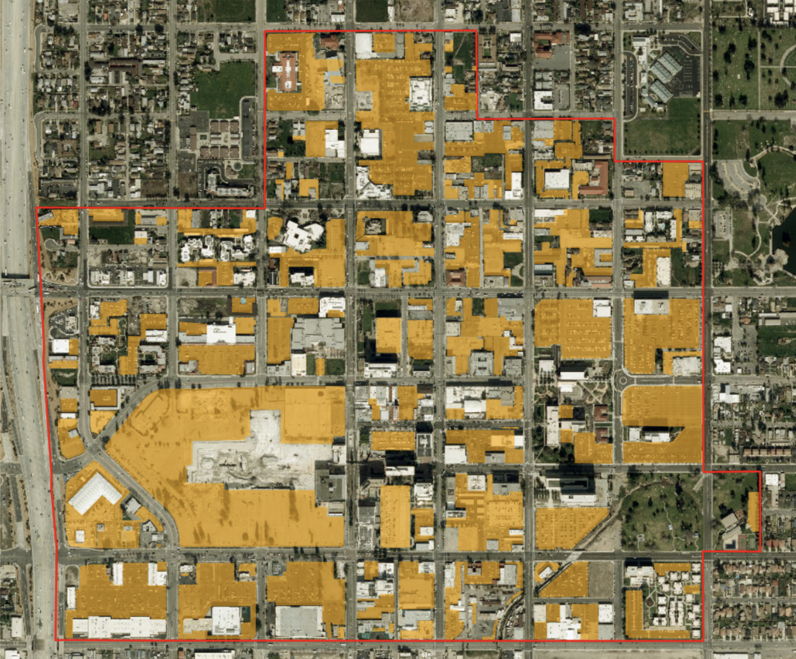
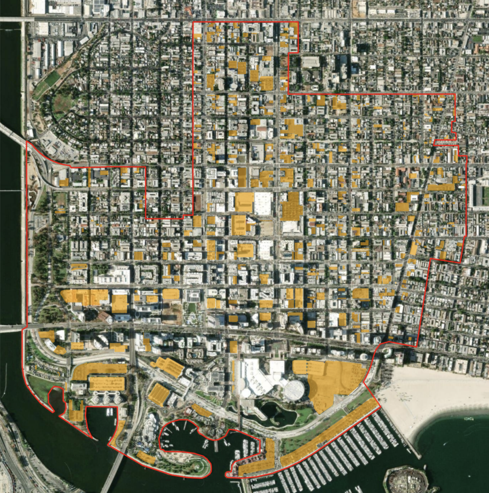
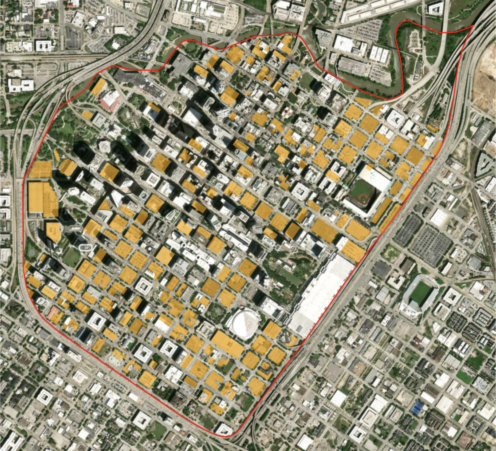
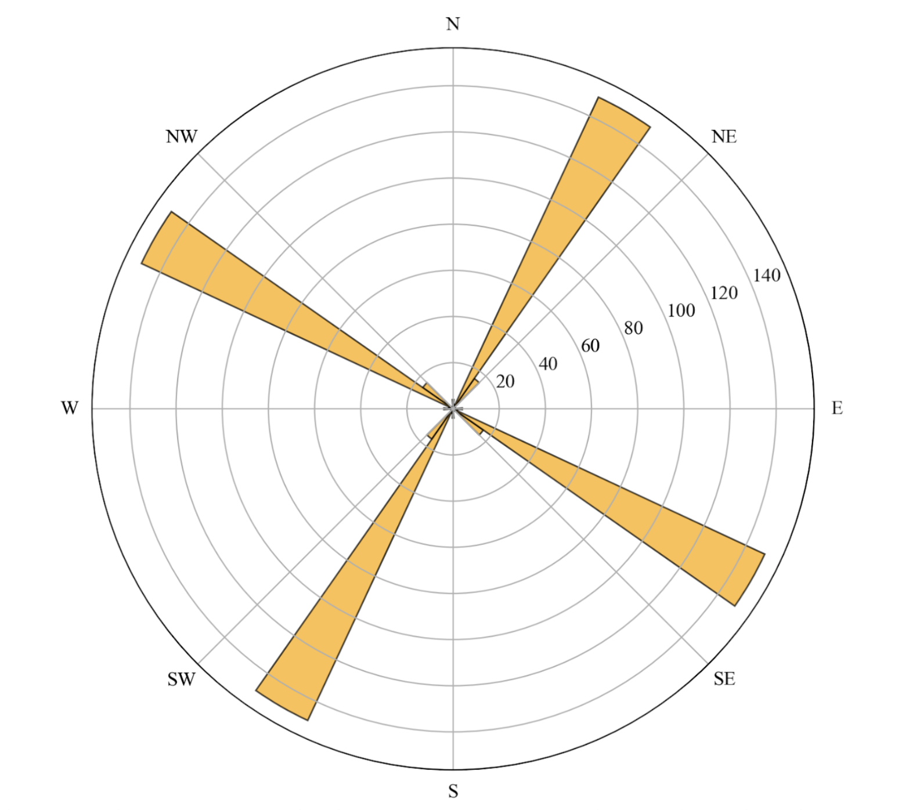
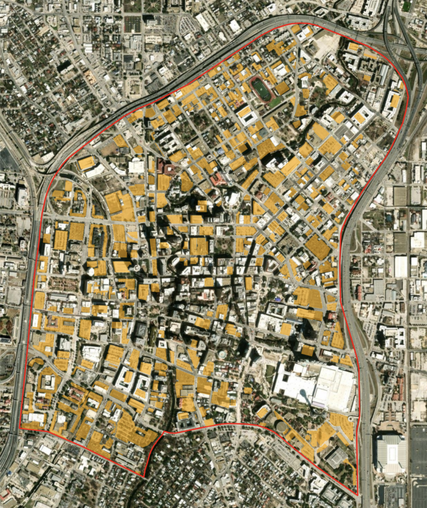
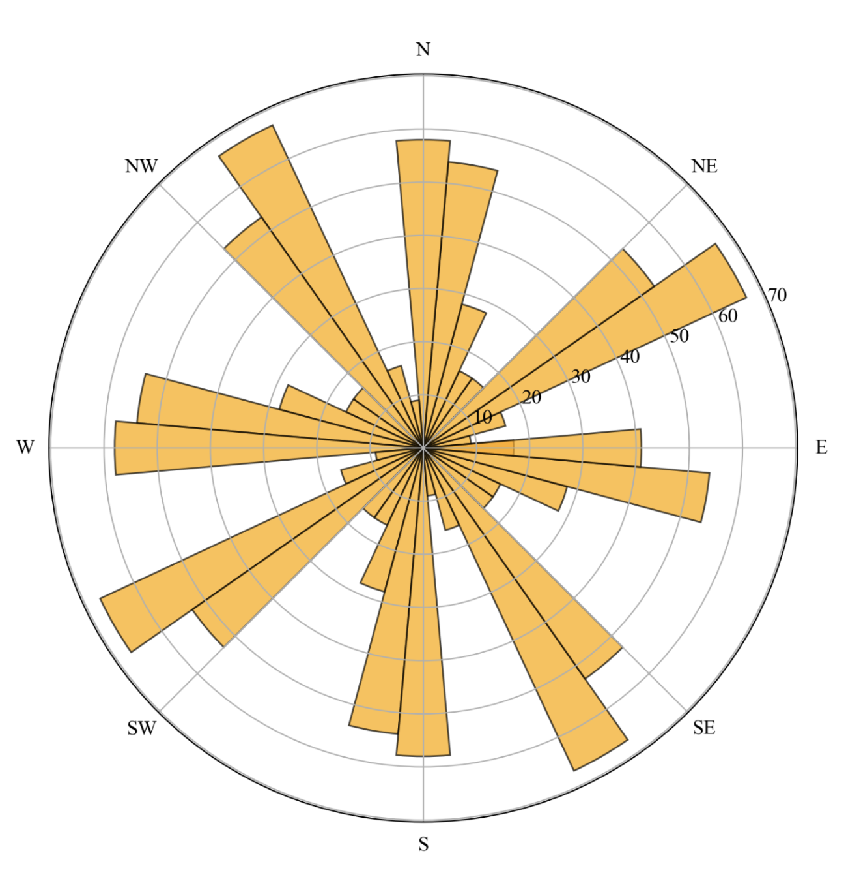
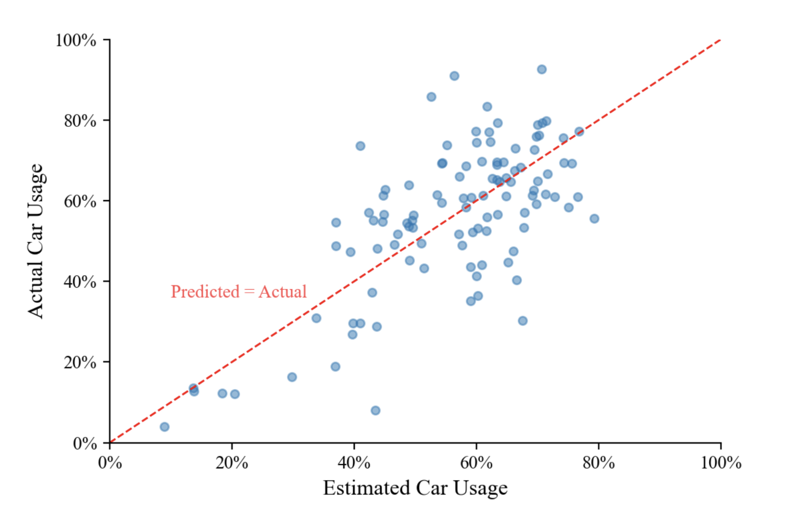
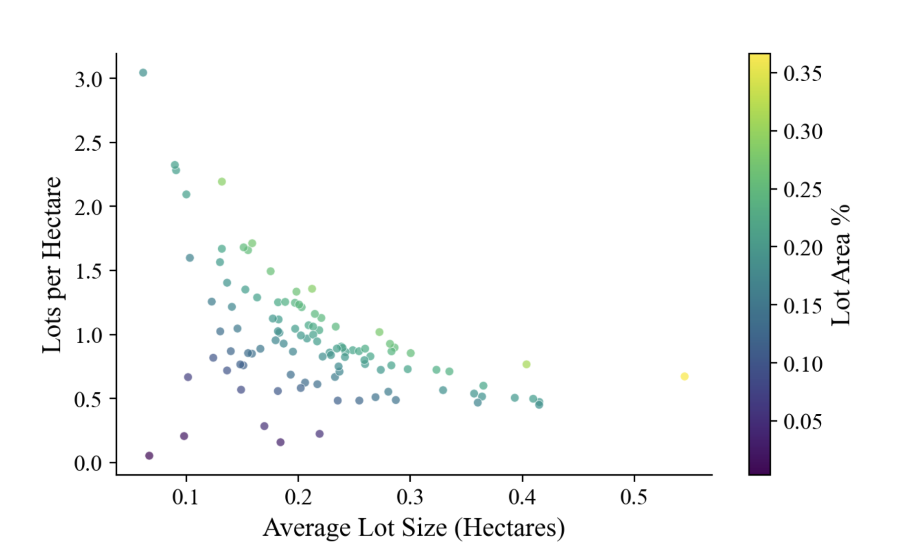

[ View code on GitHub](https://github.com/lukegbenson/parking_lot_analysis){.btn .btn-outline-primary .btn-sm}

# A ridiculous question?

There’s nothing inherently evil about parking. In a country built around car transport, like the US, it ensures that drivers have somewhere to leave their cars near their homes, close to work, or right in front of the grocery store.

But, man, does it make for an [ugly](https://images.squarespace-cdn.com/content/v1/57363f21f699bbae5ebeb9e8/1468253438267-UI484QZM3WU6UGBGC9FN/Half+empty+parking+lot.jpg?format=1500w){target="_blank"} landscape.

It takes up space that could otherwise be used to create dense, walkable neighborhoods. Minimum parking requirements for new developments [drastically increase](https://vtpi.org/park-hou.pdf){target="_blank"} housing prices. And [research](https://journals.sagepub.com/doi/abs/10.1177/0042098021995139){target="_blank"} has shown that parking supply actually impacts transportation decisions, leading people to drive more frequently. Once people drive more frequently, the next step, historically, has been to... build more parking.

So parking and driving are, obviously, related. But maybe I should take it a step farther (too far?). 

**What if we could estimate how much people drive simply by looking at parking lots?**

Forget parking prices, transit access, and employment density. Ignore population sociodemographics. For now, let's not think about many of the things that actually influence how people get around. Let's focus on just the parking lots.

This is, of course, a reductive and somewhat ridiculous question, but it is also precisely the point of the exercise. If all we know about a city is where its parking lots are, how much can we learn about its car usage?[^1]

[^1]: To estimate car usage in central city areas, I look to the US American Community Survey (ACS). The ACS comes up with [estimates](https://data.census.gov/table?q=b08301&g=010XX00US$1500000){target="_blank"} for the total number of travel to work trips within each US Census area and the number of those trips which are taken via car. While work trips may not be a perfect stand-in for all trips, the percentage of total work trips taken via car seems like a reasonable estimate for car usage.

I will not employ any complex machine learning approach here. Instead, I'll engineer a handful of features from city parking lot footprints and fit a simple linear model. Let's see what we get.

# Lot maps

The [Parking Reform Network](https://parkingreform.org/){target="_blank"} (PRN) has mapped surface parking and above ground garages within the [highest-density zoning district](https://parkingreform.org/resources/parking-lot-map/parking-lot-map-boundary-methodology/){target="_blank"} of more than 100 US cities.[^2]

[^2]: While [Open Street Map](https://www.openstreetmap.org){target="_blank"} (OSM) contains community-contributed parking locations and some [individual cities](https://data.cityofnewyork.us/City-Government/NYC-Planimetric-Database-Parking-Lot/h7zy-iq3d){target="_blank"} maintain open-source lot datasets, the PRN maps comprise the most comprehensive curated dataset for off-street parking in US cities. 

This dataset contains essentially one useful piece of information: **where the parking lots are**. There is no additional information about how many cars fit in each lot, what the parking costs, whether the lots are full or sit empty most of the day. 

Rather than pulling in outside data to fill in these gaps, I'll construct a few variables using only the geographic footprint of the lots. The goal is not to build the best possible model of car usage. Instead, I want to see how much explanatory power I can get from the small amount of information I do have.

I construct the following variables.

**Lot area percentage**: *The percentage of the total area of the central city which is covered by parking lots.*

The leader in this category is San Bernardino, California, with more than 36.6% of its total space dedicated to surface and above ground parking.

::: {.fig-narrow style="--fig-width: 80%"}

:::

**Average lot size**: *The average size of a parking lot in the city.*

With massive lots across the central area, San Bernardino also tops all cities in this category at more than half a hectare per parking lot.

**Gini coefficient**: *A measure of the distribution inequality of parking lot sizes.*

Measured from 0 (equal) to 1 (unequal), this value captures how the total parking space is distributed across lots. Is the total parking area made up of several evenly-sized lots? One giant lot and a bunch of small ones?

At 0.71, Long Beach, California has a high Gini coefficient: the lot area is distributed very unevenly across lots. There are a couple lots near the coast which take up a lot of space and then tons of small lots scattered throughout the rest of central city.

::: {.fig-narrow style="--fig-width: 80%"}

:::

Compare that to Houston, Texas, where the Gini coefficient is just above 0.35 and the lots are roughly all the same size.

::: {.fig-narrow style="--fig-width: 80%"}

:::

**Orientation entropy**: *A measure of the directional disorder of parking lot orientations.*

This metric is common in [street network analysis](https://www.nature.com/articles/srep03324){target="_blank"}, and is useful in analyzing the level of order or planning in the built environment. Take Houston again, for example. The lots are almost all aligned with the principal directions of a clear street grid, and so entropy is low. A rose diagram highlights the distribution of these lot directions.

::: {.fig-narrow style="--fig-width: 80%"}

:::

Compare this to Houston’s fellow Texas city, San Antonio, which has one of the highest orientation entropies in the dataset: the street network molds and twists across overlapping sub-grids with lots taking on shapes that the streets afford them.

::: {layout-ncol=2}

:::

::: {.figure-caption}
Parking lots in San Antonio are oriented in many directions, indicating high orientation entropy.
:::

Using our four parking lot variables, how accurately can we estimate car usage in the central area of the city? Which factors matter and which don’t?

# Estimating car usage

At this point, there are several ways I could make this more complicated. I could add a set of demographic, geographic, and economic variables. I could use a random forest model, include a cross-validation scheme, or just generally use more sophisticated modeling techniques.

But I'm not going to do that.

The purpose here is that I want to estimate a multifaceted, complex behavioral data point using this almost comically small amount of information. Appropriately, I keep the model simple as well: a linear regression using the four parking-lot variables above.

And, surprisingly, it works pretty well.

**More than 50% of the variation in car usage in city central areas can be explained by parking lots alone.** If all we know about a central city area is the coordinates of its parking lots, we can do a pretty good job of estimating how frequently people who live there drive to work.

::: {.fig-narrow style="--fig-width: 80%"}

:::

To be clear, this does not mean that parking lots are a magical crystal ball for transportation behavior. The model is deliberately simple, and these variables are almost surely standing in for a whole collection of other characteristics of the built environment.

The actual model used to estimate car usage relies primarily on two factors: 1) the square root of lot area percentage, and 2) the average lot size. The Gini coefficient and orientation entropy, while interesting, are ultimately not useful in predicting car usage.

::: {style="width: 80%; margin: auto;"}
| Factor                  | Relationship          |
|:------------------------|:----------------------|
| √Lot Area Percentage    | Strongly positive |
| Average Lot Size        | Moderately negative |
| Gini Coefficient        | Insignificant  |
| Orientation Entropy     | Insignificant |
:::

Lot area percentage has a strong positive relationship with car usage: the more space dedicated to parking, the higher the percentage of trips involving a car. Intuitively, this makes sense. The presence of the square root of the variable indicates that the impact of lot area percentage on car usage actually diminishes as we increase lot area percentage: we're going to see a larger spike in car usage going from 10% parking to 20% parking than from 20% to 30%.

Average lot size has a smaller but still significant negative relationship with car usage, meaning that larger lot sizes actually correspond with a slight dip in car usage. Wouldn’t we expect larger lots to be associated with less walkable areas, more sprawl and, therefore, greater car usage?

The important thing to note here is the model already accounts for the city’s total lot percentage: lot size is only associated with a dip in car usage when we've also considered total parking. The negative relationship makes sense when thinking about how average lot size interacts with lot density. Given two cities with the same total lot percentage, the city with the larger average lot size will (mathematically) have fewer lots per hectare. And it makes sense why a city with a few large lots might be less car dependent than the city with several smaller lots: the presence of many smaller lots implies a kind of ubiquity of car travel, while a few bigger lots may signify that the city is more of a park-then-walk destination for commuters living outside the central area.

::: {.fig-narrow style="--fig-width: 80%"}

:::

# Moving forward

No, I am not recommending that cities use parking lot footprints as their method for predicting future car usage. 

Nor am I claiming that a four-variable linear model has somehow uncovered the underlying mechanism of transportation decisions. This exercise is deliberately frivolous and reductive. There are many demographic, geographic, and economic variables which would improve a model like this, and much more sophisticated methods for better reflecting the complex relationships that drive car usage. 

But the fact that we can throw four features derived from parking lot footprints into a very simple model and explain more than half the variation in car usage is pretty striking. The connection between the physical space designated for car storage and the tendency for people to drive their cars is clear. If we continue to design our cities as giant storage units for cars, we can’t be surprised when our streets remain filled with them.
