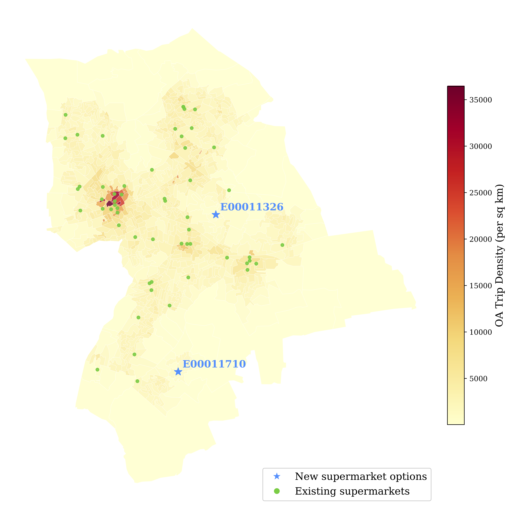
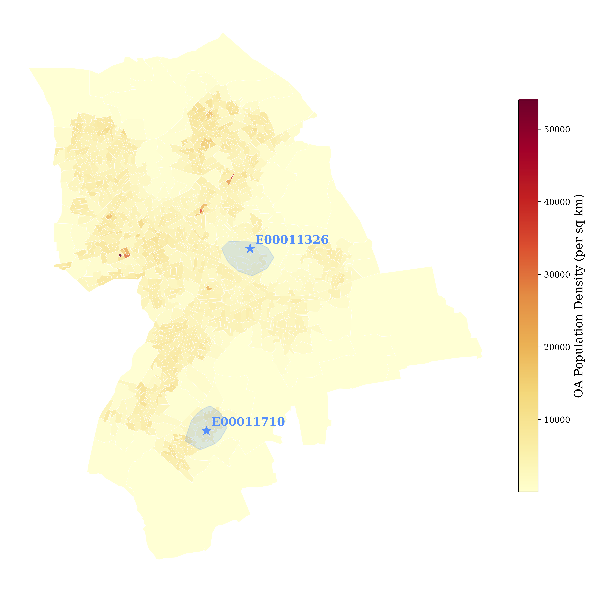

[ View code on GitHub](https://github.com/lukegbenson/supermarket_placement){.btn .btn-outline-primary .btn-sm}

A new supermarket is opening in the London Borough of Havering, and two potential locations are under consideration. Where is the best location? How can I even best model this problem?

# Introducing spatial interaction models

Spatial interaction models estimate the flows between locations by using location features and some representation of the cost of getting between those locations. Specifically, the most basic model considers the trips between two places to be proportional to the product of the weight, or "mass", of the origin and destination and inversely proportional to the cost or distance between the two.

$$
    T_{ij} = k O_i^\alpha D_j^\gamma d_{ij}^{-\beta}
$${#eq-basic-sim}

In @eq-basic-sim, the origin weight of any node $i$, $O_i$, the destination weight of a node $j$, $D_j$, and the distance between the two, $d_{ij}$, are all known inputs. The number of trips, $T_{ij}$, is the variable that we are trying to model using these variables. The parameters $k$, $\alpha$, $\gamma$, and $\beta$ are all calibrated to best model the number of trips. $\alpha$ represents the impact of an origin's weight on the number of trips: values greater than 1 indicate that increases in origin weight lead to disproportionately larger impacts to the number of trips, and values less than 1 indicate disproportionately smaller impacts. Similarly, $\gamma$ represents the impact of destination weight on the number of trips. $\beta$ represents the deterrence power of distance: lower values of $\beta$ would suggest that distance is not a huge deterrent, while high values would indicate that flows are very sensitive to increasing distance.

A standard approach for calibrating these parameters is through Poisson regression, a statistical method which seeks to minimize the difference between estimated and observed trips under the assumption that these trips follow a Poisson distribution.[^1] Modeled through a Poisson regression, the total number of (unrounded) estimated flows will equal the total number of observed flows. However, the total estimated flows for any given origin or destination may vary widely from its observed flows. For this reason, this initial model is defined as an **unconstrained** spatial interaction model.

[^1]: Poisson distributions are a nice way to represent count data which are non-negative and often right-skewed.

Constrained spatial interaction models are extensions of this initial model. The **production-constrained** model conserves the total flows for each origin by setting $O_i$ to the number of trips starting at origin $i$ and then explicitly imposing that the total number of estimated flows at origin $i$ sum to $O_i$. Instead of using a global scalar, $k$, there is a balancing factor for each origin, $A_i$. $A_i$ is essentially a scalar for each individual origin, and I can define it precisely to satisfy the desired imposed constraint.

$$
    T_{ij} = A_i O_i D_j^\gamma d_{ij}^{-\beta}
$${#eq-pc_sim}

Where I define $A_i$ as:

$$
    A_i = \frac{1}{\sum_j D_j^\gamma d_{ij}^{-\beta}}
$$

If I substitute this value of $A_i$ back into @eq-pc_sim, after a little math of summing over the total flows at each destination, I would arrive at: $O_i=\sum_j T_{ij}$, i.e. that the sum of all estimated trips from an origin is equal to the total observed flows at that origin.

**Attraction-constrained** models similarly conserve the total flows for every destination by setting $D_j$ to the number of trips arriving at destination $j$ and then imposing that $D_j=\sum_i T_{ij}$. $B_j$ represents a balancing scalar for a given destination $j$, and I again define it in a way which allows me to impose the constraint.

$$
    T_{ij} = D_j B_j O_i^\alpha d_{ij}^{-\beta}
$${#eq-ac_sim}

Where:

$$
    B_j = \frac{1}{\sum_i O_i^\alpha d_{ij}^{-\beta}}
$$

Substituting this value of $B_j$ back into Equation @eq-ac_sim and summing over origins at the given destination, I end up with: $D_j=\sum_i T_{ij}$, i.e. that the sum of all estimated trips to a destination is equal to the total observed flows at that destination.

Finally, **doubly-constrained** models impose both origin totals, $O_i=\sum_j T_{ij}$, and destination totals, $D_j=\sum_i T_{ij}$, so that both the total origin and destination flows are preserved.

$$
    T_{ij} = A_i B_j O_i D_j d_{ij}^{-\beta}
$${#eq-dc_sim}

The balancing factors are again defined to impose these constraints.[^2]

[^2]: Note that the balancing factors are actually defined by each other. Algorithmically, this means I run an iterative process where I set each factor to an initial value and stop once the values are stable.

$$
    A_i = \frac{1}{\sum_j B_j D_j d_{ij}^{-\beta}}
$$

And:

$$
    B_j = \frac{1}{\sum_i A_i O_i d_{ij}^{-\beta}}
$$

Deciding which model to use depends on the conceptual problem at hand. Exploratory analysis for estimating the pull or push of specific locational features might not require anything beyond an unconstrained model. If we know where people live and want to estimate how a new mall will impact shopping patterns, a production-constrained model is most appropriate. On the other hand, say we know where people work and want to analyze how new housing infrastructure will affect where workers commute from -- an attraction-constrained model would be best here. Finally, a doubly-constrained model is most fitting for the kind of problem where both origin and destination totals are known, such as in migration analysis when we know how many people leave and arrive in each country and want to estimate the specific country-to-country flows.

# The placement problem at hand

I am interested in modeling the flows from 2021 Output Areas (OAs) to supermarket locations in the London Borough of Havering. For this analysis, it seems reasonable to assume that supermarket conditions, including closures and openings, would not impact where people live in the short-term and, therefore, that the populations of each OA will remain fixed. Supermarket conditions will, however, impact where people choose to shop: if a new supermarket pops up, some shoppers will abandon their former store and head to the new one. For this reason, I fit a **production-constrained** model in which total trips originating from each OA are conserved while the destination flows to supermarkets are allowed to adjust.

In this problem, $T_{ij}$ represents the number of trips from OA $i$ to supermarket $j$,[^3] $O_i$ is the population of each OA, and $D_j$ is a proxy for the weight or pull of the supermarket: the area of the supermarket. $d_{ij}$ is the distance in meters between the OA and the supermarket, and so it aptly represents a deterrence factor: the farther a supermarket, the more time and energy needed for people to walk there.

[^3]: The way the data is constructed, this variable is actually the number of trips for all activities. I use it as a proxy for the number of supermarket trips.

Above, I introduced the models where trips were a function of an inverse power law of distance, i.e. $d_{ij}^{-\beta}$. However, another way to represent the deterrence of distance is with the negative exponential distance decay function: $\exp{(-\beta d_{ij})}$. The negative exponential function tails off more quickly than the inverse power function, making it perhaps better suited for smaller-scale urban process like this. [Similar research](https://pmc.ncbi.nlm.nih.gov/articles/PMC5627933/){target="_blank"} modeling trips to retail centers through a production-constrained model also employed a negative exponential distance decay function. Given this precedent in the literature, I also utilize in the negative exponential function for distance to model trips:

$$
    T_{ij} = A_i O_i D_j^\gamma \exp{(-\beta d_{ij})}
$${#eq-initial_sim_formula}

The goal of this modeling is not accurate predictions but, rather, to arrive at some estimate of the coefficient values of these variables. The key model coefficients and flow totals are shown in @tbl-initial-sim-coefs and @tbl-initial-sim-flows, respectively. The total flows at each origin are conserved. Rounding each flow to the nearest integer allows us to estimate real traveler flows, but also reduces the flow total due to rounding error. 

::: {style="width: 80%; margin: auto;"}
| Variable | Coefficient |
|---|---|
| $\gamma$ | $0.116$ |
| $\beta$ | $2.26 \times 10^{-5}$ |
: Model coefficient values {#tbl-initial-sim-coefs}
:::

::: {style="width: 80%; margin: auto;"}
| Observed | Estimated | Rounded |
|---|---|---|
| $80,604$ | $80,604$ | $79,358$ |
: Flow totals {#tbl-initial-sim-flows}
:::

# Investing in a location

Now I want to use our calibrated model to estimate the total flows to two possible locations for a new small or large supermarket: OAs E00011326 and E00011710. To do this, I add the potential supermarket to the model and, using the learned $\gamma$ and $\beta$ parameters from the previous model, recalibrate the $A_i$ values to ensure our origin totals are conserved. 

::: {style="width: 90%; margin: auto;"}
| Size (m²) | Location | Estimated Flows |
|---|---|---|
| 280 | E00011326 | 1,382 |
| 280 | E00011710 | 1,253 |
| 2,800 | E00011326 | 1,796 |
| 2,800 | E00011710 | 1,629 |
: Supermarket flow estimates {#tbl-supermarket-estimates}
:::

Under both supermarket size options, placing a supermarket within E00011326 generates more total flows. Based on this evidence alone, I would suggest investing in OA E00011326 to attract greater numbers of shoppers.

::: {.fig-narrow style="--fig-width: 95%"}
{#fig-trips-map}
:::

However, there are critical spatial limitations of this model. @fig-trips-map shows that E00011326 is in the middle of the borough, while E00011710 lies toward the edge. E00011326 is also much closer to higher-density trip neighborhoods. Given that flow estimate differences between the two options are driven by their distance to only OAs in Havering (their size, or "pull", is the same), E00011326 is bound to generate greater flow estimates due to its centrality and proximity to high-trip Havering OAs. I am considering Havering as a closed-boundary system, but in reality, there would be many shoppers beyond the southeastern boundary who would travel to a supermarket in E00011326.

There's a second edge effects limitation with using our trips data: total trips are based on trips to only the supermarkets within the boundary. People in OAs on the periphery of the boundary are more likely to make trips outside of the boundary, and so these periphery OAs will be underrepresented in the data. The number of trips "available" from OAs closer to E00011710 is, therefore, less than it would be in reality.

Additionally, based on the available locations, a supermarket in E00011326 would face stiffer competition. While this model relies on distance, it treats destinations as independent: two stores generate the same number of estimated trips from a given OA whether those stores are right next to each other or on opposite sides of the OA. Given that a supermarket in E00011710 has fewer supermarkets to compete with, it may perform better than the model estimates.

Given the above limitations and the relatively close estimates for both small and large stores, a supermarket in E00011710 may, despite what the model suggests, actually end up being the best choice.

# What if transport costs increase?

Now let's assume there is a sharp increase in transport costs: sidewalk conditions have deteriorated, pedestrian light times have decreased, and congestion is making intersections difficult to navigate, resulting in walk trips taking *twice* as long as they did before. @tbl-cost-up-supermarket-estimates highlights how E00011326's centrality and proximity to trip-dense neighborhoods benefits it in this scenario. When transport costs increase across the board, the affinity for nearer places over farther places widens: the proportional increase in cost is the same, but the absolute difference in cost for farther places is greater.

In these results, we see that flows to E00011326 go up in this scenario, while flows to the less central and less proximate-to-dense-trip-neighborhoods E00011710 drop significantly. At this point, E00011326 may truly be the advisable location.

::: {style="width: 95%; margin: auto;"}
| Size (m²) | Location | Estimated Flows | Change in Flows |
|---|---|---|---|
| 280 | E00011326 | 1,395 | 13 |
| 280 | E00011710 | 1,152 | -101 |
| 2,800 | E00011326 | 1,813 | 17 |
| 2,800 | E00011710 | 1,498 | -131 |
: Supermarket flow estimates under 2x cost increase {#tbl-cost-up-supermarket-estimates}
:::

Just as before, flows are conserved with these estimates by recalibrating $A_i$ with the new cost values to enforce the constraint of $O_i=\sum_j T_{ij}$.

# Accounting for a realistic mode of travel

To estimate accessibility within a 15-minute walk of the potential supermarket sites, I assume that the average walking speed is [4 km per hour](https://tfl.gov.uk/corporate/transparency/freedom-of-information/foi-request-detail?referenceId=FOI-0318-2526){target="_blank"}. I use the walking network to estimate which streets are accessible within this amount of time, and then create a convex hull (a simple polygon) from those streets. The portion of each OA which falls within that polygon is then used to estimate the total population within a 15-minute radius.[^4]

[^4]: That is, if 50\% of an OA is covered by the convex hull, I (perhaps crudely) estimate that 50\% of its population falls within the 15-minute radius.

::: {.fig-narrow style="--fig-width: 95%"}
{#fig-15-min-radius}
:::

In @fig-15-min-radius, I estimate that 2,906 people would be within a 15-minute walk of a supermarket in E00011326, while 4,452 people would have 15-minute walking access to one in E00011710. This data highlights that, while the estimated flows to a supermarket in E00011326 were higher from the oroginal calibrated model, a supermarket within E00011710 would have a greater population within a more typical walking trip distance length. Given the fact that the trips data represents all trips, not just those to a supermarket, and that people are probably even more likely to value proximity for supermarkets than other retail activities, this data serves as additional evidence for E00011710 as the recommended supermarket location.