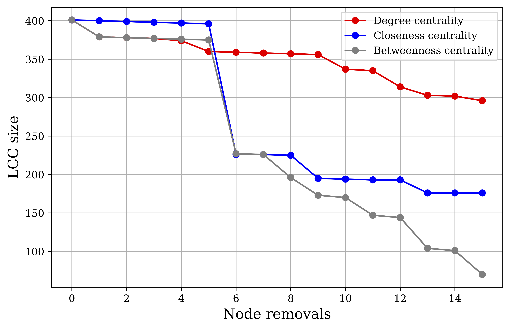

# Identifying important stations

## Centrality measures

The London Underground network can be first conceptualized as a graph in which each station is connected to its adjacent stations which are one stop away.[^1] Ignore the distance between stations or the number of people who actually use these connections for now. This is a simple *topological* network.

The following centrality measures are useful for identifying the most important nodes in the network.

[^1]: The entire network includes London Underground and London Overground lines. Given that many overground lines integrate well with the underground network, all London Overground nodes and edges were included in my analysis. Throughout this writing, "underground" is mentioned colloquially in reference to the entire network of all these stations.

**Degree Centrality**

In an undirected graph, the degree of any node $i$, denoted as $k_i$, is the number of edges or links attached to it. The degree centrality of each node is simply the fraction of all other nodes to which it is connected:

\begin{equation}
    C(i) = \frac{k_i}{n - 1}
\end{equation}

In the context of the underground, this measure captures the fraction of all other stations to which each station is connected. The stations that rank highest in this metric allow passengers to reach the most stations directly within one stop, and so these stations probably serve as important transfer hubs. In @tbl-deg-cent, we see this to be the case: multi-line hubs like Stratford, Bank and Monument, and King's Cross top the rankings.[^2]

[^2]: It is important to note that lines which run the same path from one station to the next are represented by only a single edge in this network. At King's Cross, for example, there is only one edge representing the shared paths of the Circle, Metropolitan, and Hammersmith \& City lines.

| Rank | Station | Degree Centrality |
|---:|---|---:|
| 1 | Stratford | 0.0225 |
| 2 | Bank and Monument | 0.0200 |
| 3 | King's Cross St. Pancras | 0.0175 |
| 3 | Baker Street | 0.0175 |
| 5 | Waterloo | 0.0150 |
| 5 | Liverpool Street | 0.0150 |
| 5 | West Ham | 0.0150 |
| 5 | Canning Town | 0.0150 |
| 5 | Green Park | 0.0150 |
| 5 | Earl's Court | 0.0150 |
| 5 | Oxford Circus | 0.0150 |
: Top stations ranked by Degree Centrality {#tbl-deg-cent}

**Closeness Centrality**

In a topological network, the shortest path between any two nodes in the network, also called the *geodesic*, is the path which requires the fewest number of edges to traverse from one node to the other. Closeness centrality is then defined by the inverse of a node's mean geodesic distance to all other (reachable) nodes. For any two nodes $i$ and $j$, I denote the geodesic distance as $d_{ij}$, and define closeness centrality as:

\begin{equation}
    C(i) = \frac{n-1}{\sum_{j}^{n-1} d_{ij}}
\end{equation}

In the underground network, the top-ranked stations by closeness centrality are the stations which require, on average, the fewest number of stops to get to any other station. These stations are crucial because they are centrally-located hubs which minimize the number of stops and, consequently, time needed for passengers to get anywhere in the network. Green Park, Bank and Monument, and King's Cross are all central stations with close proximity to most lines. These stations fittingly top the rankings in @tbl-close-cent.

| Rank | Station | Closeness Centrality |
|---:|---|---:|
| 1 | Green Park | 0.1148 |
| 2 | Bank and Monument | 0.1136 |
| 3 | King's Cross St. Pancras | 0.1134 |
| 4 | Westminster | 0.1125 |
| 5 | Waterloo | 0.1123 |
| 6 | Oxford Circus | 0.1112 |
| 7 | Bond Street | 0.1110 |
| 8 | Angel | 0.1107 |
| 8 | Farringdon | 0.1107 |
| 10 | Moorgate | 0.1103 |
: Top stations ranked by Closeness Centrality" {#tbl-close-cent}

**Betweenness Centrality**

The betweenness centrality of a node is the share of geodesics between all nodes in the network which pass through that node. Denoting $n^i_{st}$ as a binary variable which is 1 if node $i$ is on the geodesic from node $s$ to node $t$ and 0 if not, and $g_{st}$ as the total number of geodesics from $s$ to $t$ (there can be multiple shortest paths), betweenness centrality is defined as:[^3]

[^3]: The presented equation also scales by the inverse of the number of possible $s,t$ pairs, which is $\binom{n-1}{2}$.

\begin{equation}
    C(i) = \frac{2}{(n-1)(n-2)} \sum_{s,t} \frac{n^i_{st}}{g_{st}}
\end{equation}

The top-ranked stations by betweenness centrality are the stations which most often sit on the optimal route from one station to any other. These stations can, therefore, be thought of as critical bridges within the system which would cause the greatest amount rerouting if removed from the network.[^4] @tbl-bet-cent highlights that Stratford, a critical bridge for eastern DLR stations, and Bank and Monument, a centrally-located multi-line station allowing connections across all directions, lead all stations in this measure.

[^4]: I should caveat that "greatest amount of rerouting", here, does not consider actual transport flows.

| Rank | Station | Betweenness Centrality |
|---:|---|---:|
| 1 | Stratford | 0.2978 |
| 2 | Bank and Monument | 0.2905 |
| 3 | Liverpool Street | 0.2708 |
| 4 | King's Cross St. Pancras | 0.2553 |
| 5 | Waterloo | 0.2439 |
| 6 | Green Park | 0.2158 |
| 7 | Euston | 0.2083 |
| 8 | Westminster | 0.2033 |
| 9 | Baker Street | 0.1916 |
| 10 | Finchley Road | 0.1651 |
: Top stations ranked by Betweenness Centrality" {#tbl-bet-cent}

## Which measure is most appropriate?

Removing nodes in order of their importance according to each centrality measure gives us some sense of how suitable that measure is for assessing network vulnerability. Each time I remove a node, the connected underground system is potentially separated into multiple disconnected components. The size of the remaining largest connected component (LCC) indicates the severity of the loss of connectivity. Removing a one-degree node at the end of a line, for example, will reduce the LCC size by one and leave most of the system functioning as usual. However, removing the only node that connects two components of the graph could sink the LCC size and leave passengers completely unable to travel to an entire half of the network. The centrality measure which displays the steepest dip in LCC size over several high-ranking node removals is the measure that probably best conveys which nodes are most important for network vulnerability.

{#fig-network-vulnerability}

For each centrality measure, I ranked all nodes, removed the highest ranking node, and then computed the LCC. I then ran this same process again, 15 times in total. 

@fig-network-vulnerability displays the results. While the three measures show comparable results for the first five removals, removing the highest-ranking betweenness centrality node leads to the steepest drop-off in LCC size at future removals. Betweenness centrality should, therefore, be considered most appropriate for capturing network vulnerability. The stations identified by betweenness centrality are not only critical bridge points for optimal travel paths but are also vital for ensuring passengers have access to greater portions of the underground network at large.

# Leveling up with passenger flows

## Which station is the most important now?

In a weighted network, each edge carries a value. Here, I define edge weight based on the number of commuter flows during the morning AM peak, i.e. the number of commuters whose route includes the edge between two stations. A greater number of flows between two stations signifies greater strength of connection between those stations: the more people who use the path, the more important it is to the network.

Computing centrality measures on a weighted network requires slight modifications to those measures. For degree centrality, instead of using the number of connections (degree) of a node, I use the total weight of those connections. The node with the greatest total flows will rank highest in degree centrality.

Closeness centrality and betweenness centrality both utilize the shortest paths between nodes. In a weighted network, the shortest path is no longer defined by the fewest number of hops needed to get from one node to the other, but by the path which minimizes the distance needed to get between those nodes. Given that adjacent nodes with greater flows between them are "closer" than adjacent nodes with fewer flows, I compute the geodesic distances between nodes in the network by using the paths which minimize the aggregated *inverse* flows between nodes.

| Measure | Most Important Station |
|---|---|
| Degree Centrality | Bank and Monument |
| Closeness Centrality | Green Park |
| Betweenness Centrality | Green Park |
: Top station in a network weighted by flows" {#tbl-important-stations}

With the flows-weighted network, it may also be important to consider eigenvector centrality. For a given station, eigenvector centrality considers the importance or centrality of stations connected to it. In the underground network, this measure would help identify stations which are connected to other high-flow stations along high-volume routes.

Mathematically, eigenvector centrality uses the network adjacency matrix, $A_{ij}$, and the largest eigenvalue of the matrix, $\lambda$, to recursively update the centrality score of a node based on the centrality scores of its neighbors:

\begin{equation}
    C(i) = \frac{1}{\lambda} \sum_{j=1}^{n-1} A_{ij} C(j)
\end{equation}

@tbl-eigen shows the top stations by this measure, and, as expected, centrally-located stations within high frequency corridors top the list: Waterloo, Bank and Monument, and Westminster.

| Rank | Station | Eigenvector Centrality |
|---:|---|---:|
| 1 | Waterloo | 0.5420 |
| 2 | Bank and Monument | 0.4911 |
| 3 | Westminster | 0.4238 |
| 4 | Green Park | 0.2969 |
| 5 | Liverpool Street | 0.2621 |
| 6 | Moorgate | 0.1448 |
| 7 | Stratford | 0.1200 |
| 8 | London Bridge | 0.1192 |
| 9 | Victoria | 0.1190 |
| 10 | Oxford Circus | 0.1185 |
: Top stations ranked by weighted Eigenvector Centrality" {#tbl-eigen}

## OD flows

I now examine the original origin-destination (OD) flows matrix which was used to construct the weighted graph. The matrix gives me some level of greater granularity here, including estimates for the number of passengers during the AM peak whose journeys begin and end at every possible pair of stations.

The OD flow with the largest AM peak flows is Waterloo to Bank and Monument, with 15,946 flows. However, far more people would be impacted by a closure to Waterloo station. 67,372 passengers who start their journey at Waterloo would be disrupted and 23,408 who end their journey at the station would have to reroute. An additional 118,483 passengers travel through the station based on estimated shortest-length paths, meaning that $209,263$ morning commuters in total would be affected if trains were unable to pass through Waterloo.

## What if Waterloo closed?

The most popular journey is Waterloo to Bank and Monument. If Waterloo is closed, to which station should passengers walk in order to get to Bank and Monument?

Based on data provided by TfL, I assume the average walking speed is [4 km per hour](https://tfl.gov.uk/corporate/transparency/freedom-of-information/foi-request-detail?referenceId=FOI-0318-2526){target="_blank"}, and the speed during train disruption is [24.1 km per hour](https://tfl.gov.uk/corporate/transparency/freedom-of-information/foi-request-detail?referenceId=FOI-0126-2223){target="_blank"}.[^5] Based on these parameters, I can compute the optimal path from Waterloo to Bank and Monument, i.e. the path which would take the shortest amount of time, during station closure.

[^5]: The TfL mentions that trains go as slow as 15 mph, which is roughly 24.1 km/h. If a station were closed, I assume trains would generally travel at this slower speed.

{#fig-optimal-route}

With these parameters, the optimal route in @fig-optimal-route is for passengers to walk 13.1 minutes to Southwark, take the Jubilee line to London Bridge, and then transfer to the Northern line to get to Bank and Monument. The total trip time estimate is 18 minutes.

There are a couple key assumptions in this analysis. First, I do not account for the fact that transfers between lines take time; this would add to the total trip time. Second, to simplify the problem, I assume that all passengers start at the exact geographic coordinates Waterloo station. In the real world, while some passengers may instinctively head to the station to find that it is closed, others may see ahead of time that the station is closed and come up with an alternative route from their home or starting location.